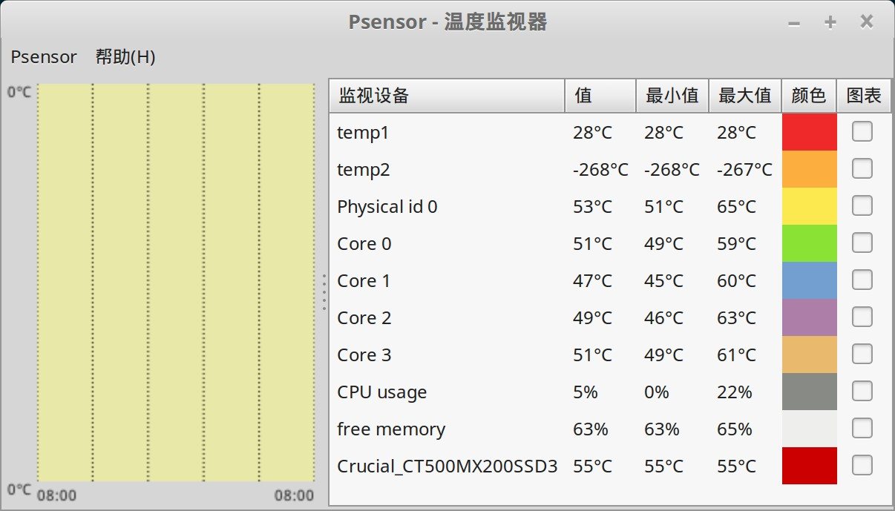
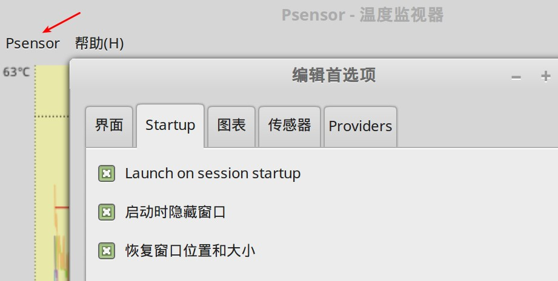
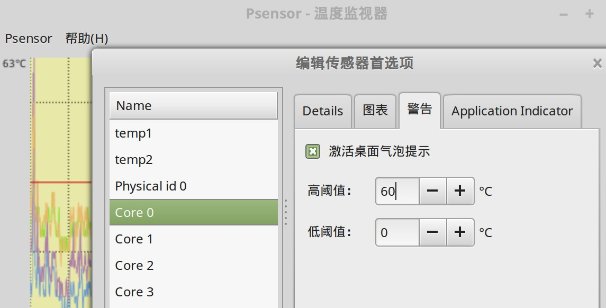

# Psensor

tags: 硬件,监控,告警,温度

Psensor 是一个硬件温度监控工具。

## 安装

可以通过软件管理器直接安装, "开始菜单" -> "系统管理" -> "软件管理器"，搜索 `psensor`，然后直接安装。

有几个软件会自动安装：

1. lm-sensors
2. hddtemp

安装完成之后，在命令行中执行 `psensor` 或者点 "开始菜单" -> "系统管理" -> "psensor" 可以打开 psensor：

## 设置

### 设置开机自启动

点红色箭头处的 "Psensor" -> "首选项" -> "startup"：

将 "Lauch on session startup" 和 "启动时隐藏窗口" 选上。

### 设置温度告警

点红色箭头处的 "Psensor" -> "传感器首选项" -> "警告"：

勾选 "激活桌面气泡提示",然后设置温度的高阈值(低阈值一般用不上)。

测试一下，故意将cpu温度的高阈值设置为当前温度以下，然后就会立即看到 Psensor 的报警： 首先有一个气泡出现在桌面，然后系统托盘处 Psensor 的图片变成红色：

将关心的几个温度，如cpu的各个核心，硬盘温度等加上告警，配合开机自启动，就可以监控到系统温度异常了。

