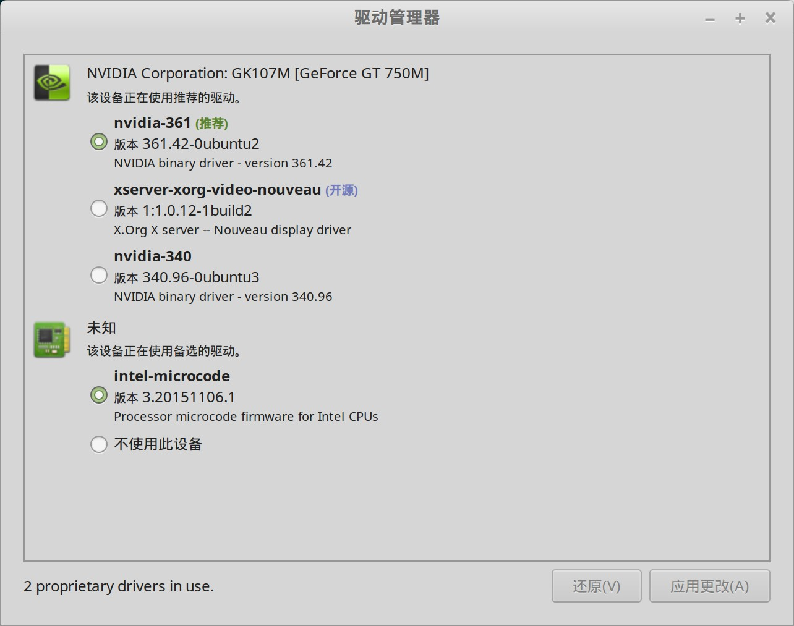
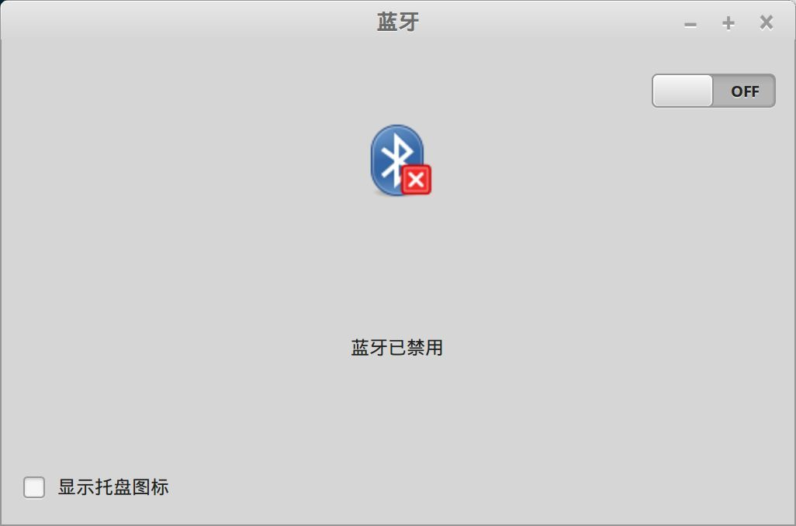

# 硬件配置

tags: 驱动

安装完成之后，需要做必要的硬件配置。

## 功能设置

### 触摸板

"开始菜单" -> "系统设置" -> "鼠标和触摸板"，点 "触摸板"，开启 “打字时禁用触摸板”。实在不能忍受打字时不小心碰到触摸板,然后光标跑不知道哪里去了的感觉......

但是，随即发现打字时还是容易被触摸板影响，最后只好选择关闭触摸板。

## 硬件设置

### Nvidia显卡驱动安装

"开始菜单" -> "系统管理" -> "驱动管理器"，

Linux Mint 会先做一次系统更新检查，然后给出可以安装的驱动列表。

只要简单选择需要的驱动版本，然后安装即可，如下图：



为了节能，在右下角找到 nvidia 的图标，设置中找到 ”select the gpu you would like to use”，默认时NVIDIA，修改为 Intel，这样平时用 Intel 集显比较节能省电噪音低。

然后，在需要用到 nvidia 独立显卡时，可以再改回来。坦言，好像基本用不上...

### AMD显卡驱动安装

> 注： AMD 的linux 驱动支持烂的要死，最好别用 AMD 的显卡！

amd 驱动下载地址：

http://support.amd.com/zh-cn/download

选择产品和操作系统之后，对于linux系统，会跳转到下面的页面：

http://support.amd.com/en-us/kb-articles/Pages/AMDGPU-PRO-Driver-for-Linux-Release-Notes.aspx

在这里可以找到下载链接，不过下载速度非常的慢，而且百度云无法离线下载。

可以换下面的地址，这里虽然下载也慢，但是可以用百度云先帮忙离线下载。

https://www.touslesdrivers.com/index.php?v_page=23&v_code=53718&v_langue=en

下载完成后，安装方式可以参考下文：

http://support.amd.com/en-us/kb-articles/Pages/AMDGPU-PRO-Install.aspx

步骤如下：

```bash
tar -Jxvf amdgpu-pro-17.10-429170.tar.xz
cd amdgpu-pro-17.10-429170
./amdgpu-pro-install -y
```

此时会报错，"Unsupported OS"：

```bash
Unsupported OS
```

打开 `amdgpu-pro-install`，找到 os_release() 函数：

```bash
function os_release() {
	......
	case "$ID" in
	ubuntu)
		PACKAGES="amdgpu-pro amdgpu-pro-lib32 amdgpu-pro-dkms"
		;;
	......
}
```

修改这个函数，将 "ubuntu)" 修改为 "linuxmint"，即:

```bash
function os_release() {
	......
	case "$ID" in
	linuxmint)
	......
}
```

修改之后继续安装即可。

为了确保当前使用的账号可以使用该 vulkan 驱动，需要将用户加入到 `video` group:

```bash
sudo usermod -a -G video $LOGNAME
```

然后重启电脑。然后，启动不起来...... 经查找是 amdgpu-pro-17.10 驱动需要 4.8 版本的内核，而 linux mint 18 的内核版本是 4.4 。

解决方案：

1. 先卸载 amdgpu-pro-17.10 驱动
2. 升级系统内核至 4.8
3. 重新安装 amdgpu-pro-17.10 驱动

> 注： 没有找到 amdgpu-pro-17.10 驱动的卸载脚本，最后修改 `amdgpu-pro-install` 的最后一行，将 `amdgpu_pro_${0##*-} "$@"` 修改为 `amdgpu_pro_uninstall` 执行即可

最后补充： 当时折腾这个显卡驱动是因为 vmware 启动虚拟机时报错说驱动有问题，无法打开显卡的硬件支持。后来发现是 vmware 的配置问题，默认情况下 mint linux 的 amd 显卡驱动时可以用的，而且稳定。所以最后的结果，我把辛辛苦苦安装好的 amd 驱动又卸载了。

### exfat支持

移动硬盘一般用的文件格式exfat，mint linux 18 之前的版本 默认不支持，需要安装 exfat-fuse / exfat-utils:

```bash
sudo apt-get install exfat-fuse exfat-utils
```

重启后生效。

对于 linux mint 18，默认已经提供了对exfat的支持，不再需要自己安装。

### 自动装载windows分区

linux mint 安装之后自带了ntfs-3g, 天然支持ntfs格式。

"开始菜单" -> "首选项" -> "开机自启动程序"，在开机自启动程序中增加开机自动装载windows分区的命令:

```bash
udisksctl mount -p block_devices/sdb4
```

具体有哪些分区可供装载，可以通过在命令行中输入 `udisksctl mount -p block_devices/` 然后双击 Tab 键列出来，如下图：


开机自启动设置如下：


### 关闭蓝牙设备

如果不需要使用蓝牙设备，可以打开 "开始菜单" -> "系统设置" -> "硬件" -> "蓝牙"，关闭对蓝牙的支持：



注意： 建议去除显示托盘图标的勾选。


